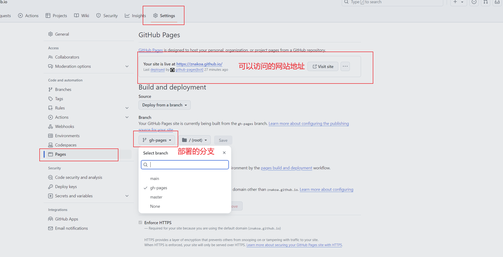
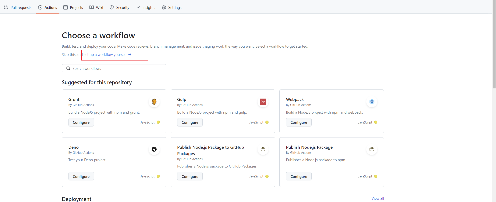
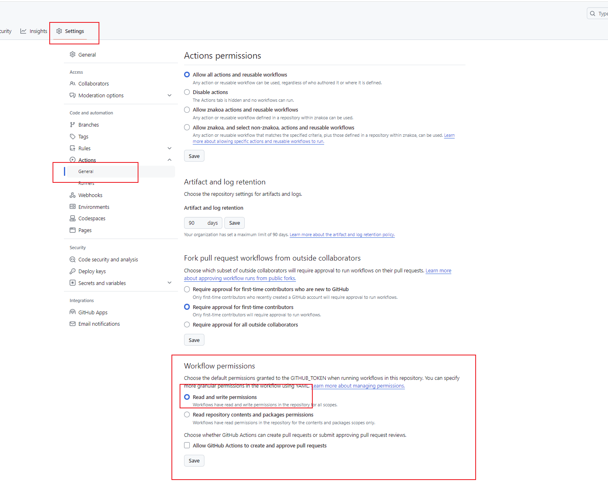

## GitHub Actions 自动部署项目踩坑

最近看到一篇关于**GitHub Actions 自动部署前端 Vue react 项目** 文章，以及 使用GitHub托管对外访问的网站， 想着正好把一个大屏项目做练手，说干就敢

<!--truncate-->


一、准备项目

​	自己搭建一个项目vue/react

二、git管理项目

​	将准备好的项目上传到自己的**GitHub**仓库里去

三、配置 **GitHub Pages**

  - 进去刚刚的github 仓库 点击 --> Setting->Page 看到下面的界面

    

- 还需要新建一个名为 **gh-pages ** 的分支，这是我们部署分支，存放的是打包后的代码

四、 配置 **GitHub Actions** 实现自动化部署

- 新建.yml文件 点击主页Actions -> New workflow -> set up a workflow yourself，当然你也可以选择一个模板，点击start commit则会自动在我们项目目录下新建.github/workflows/main.yml文件

  

​	

```yaml
name: CI Github Pages
on:
  #监听push操作
  push:
    branches:
      - master # 这里只配置了master分支，所以只有推送master分支才会触发以下任务
jobs:
  # 任务ID
  build-and-deploy:
    # 运行环境
    runs-on: ubuntu-latest
    # 步骤
    steps:
      # 官方action，将代码拉取到虚拟机
      - name: Checkout  ️ 
        uses: actions/checkout@v3

      - name: Install and Build   # 安装依赖、打包，如果提前已打包好无需这一步
        run: |
          npm install
          npm run build

      - name: Deploy   # 部署
        uses: JamesIves/github-pages-deploy-action@v4.3.3
        with:
          branch: gh-pages # 部署后提交到那个分支
          folder: dist # 这里填打包好的目录名称
```

上面整个workflow的说明：

- 只有当main分支有新的push推送时候才会执行整个workflow.
- 整个workflow只有一个job,job_id是build-and-deploy,name被省略.
- job 有三个step： 第一步是Checkout,获取源码，使用的action是GitHub官方的actions/checkout.
- 第二步：Install and Build,执行了两条命令：npm install,npm run build,分别安装依赖与打包应用.
- 第三步：Deploy 部署，使用的第三方action：JamesIves/github-pages-deploy-action@v4.3.3,它有两个参数：分别是branch、folder，更多关于这个action的详情可以去[查看](https://github.com/marketplace/actions/deploy-to-github-pages).

## 踩坑记录

首次打开找不到资源 

项目配置路径

```bash
export default defineConfig({
  plugins: [vue(), vueJsx()],
  base:'./',// 将根路径换成相对路径
  resolve: {
    alias: {
      "@": fileURLToPath(new URL("./src", import.meta.url)),
    },
  },
})
```

```bash
module.exports = {
  /**
   * publicPath 默认是 / 是根路径，这个是指服务的根路径：https://xxx.github.io/，发布后会从这个路径下找 js.css 等资源，
   而生成的网站路径是这个 Vite5-Vue3-base显然是找不到的
   * 我们需要修改为 相对路径'./' 或是‘.’ 或是 直接设置的项目子路径 :/项目名称/ 就可找到资源了
   */
  publicPath: './',
  outputDir: 'dist', // dist
  assetsDir: 'static',
  lintOnSave: process.env.NODE_ENV === 'development',
  productionSourceMap: false,
  ...
```

GitHub Actions 构建无权限

是用公开仓库 不要用私有仓库



react 项路由地址根目录匹配不到

- 在项目里面修改 路由配置文件加上 github 的仓库名

或者去修改路由模式 改为 哈希模式