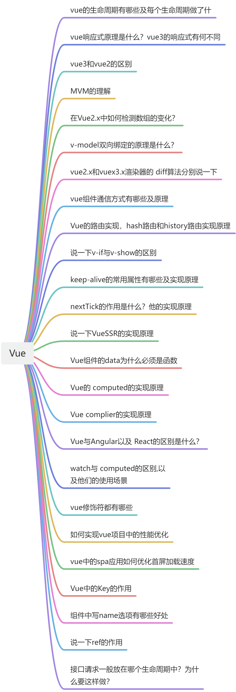
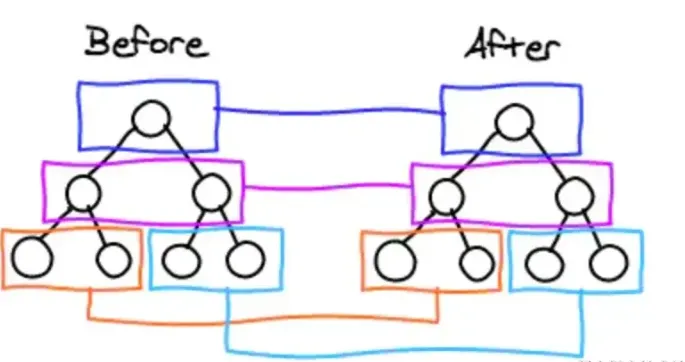
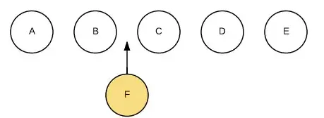
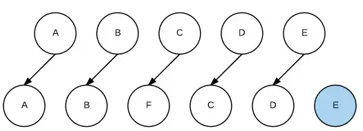
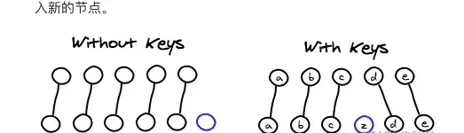

# vue 概述

<!--truncate-->



### 1.vue的生命周期有哪些及每个生命周期做了什么？

beforeCreate是new Vue()之后触发的第一个钩子，在当前阶段data、methods、computed以及watch上的数据和方法都不能被访问。

created在实例创建完成后发生，当前阶段已经完成了数据观测，也就是可以使用数据，更改数据，在这里更改数据不会触发updated函数。可以做一些初始数据的获取，在当前阶段无法与Dom进行交互，如果非要想，可以通过vm.$nextTick来访问Dom。

beforeMount发生在挂载之前，在这之前template模板已导入渲染函数编译。而当前阶段虚拟Dom已经创建完成，即将开始渲染。在此时也可以对数据进行更改，不会触发updated。

mounted在挂载完成后发生，在当前阶段，真实的Dom挂载完毕，数据完成双向绑定，可以访问到Dom节点，使用$refs属性对Dom进行操作。

beforeUpdate发生在更新之前，也就是响应式数据发生更新，虚拟dom重新渲染之前被触发，你可以在当前阶段进行更改数据，不会造成重渲染。

updated发生在更新完成之后，当前阶段组件Dom已完成更新。要注意的是避免在此期间更改数据，因为这可能会导致无限循环的更新。

beforeDestroy发生在实例销毁之前，在当前阶段实例完全可以被使用，我们可以在这时进行善后收尾工作，比如清除计时器。

destroyed发生在实例销毁之后，这个时候只剩下了dom空壳。组件已被拆解，数据绑定被卸除，监听被移出，子实例也统统被销毁。

### 2.vue响应式原理是什么？vue3的响应式有何不同

Vue在初始化数据时，会使用Object.defineProperty重新定义data中的所有属性，当页面使用对应属性时，首先会进行依赖收集(收集当前组件的watcher)如果属性发生变化会通知相关依赖进行更新操作(发布订阅)。

Vue3.x改用Proxy替代Object.defineProperty。因为Proxy可以直接监听对象和数组的变化，并且有多达13种拦截方法。并且作为新标准将受到浏览器厂商重点持续的性能优化。

❝

Proxy只会代理对象的第一层，那么Vue3又是怎样处理这个问题的呢？

❞

（很简单啊）

判断当前Reflect.get的返回值是否为Object，如果是则再通过reactive方法做代理， 这样就实现了深度观测。

❝

监测数组的时候可能触发多次get/set，那么如何防止触发多次呢？

❞

我们可以判断key是否为当前被代理对象target自身属性，也可以判断旧值与新值是否相等，只有满足以上两个条件之一时，才有可能执行trigger。

### 3.vue3和vue2的区别

- 源码组织方式变化：使用 TS 重写
- 支持 Composition API：基于函数的API，更加灵活组织组件逻辑（vue2用的是options api）
- 响应式系统提升：Vue3中响应式数据原理改成proxy，可监听动态新增删除属性，以及数组变化
- 编译优化：vue2通过标记静态根节点优化diff，Vue3 标记和提升所有静态根节点，diff的时候只需要对比动态节点内容
- 打包体积优化：移除了一些不常用的api（inline-template、filter）
- 生命周期的变化：使用setup代替了之前的beforeCreate和created
- Vue3 的 template 模板支持多个根标签
- Vuex状态管理：创建实例的方式改变,Vue2为new Store , Vue3为createStore
- Route 获取页面实例与路由信息：vue2通过this获取router实例，vue3通过使用 getCurrentInstance/ userRoute和userRouter方法获取当前组件实例
- Props 的使用变化：vue2 通过 this 获取 props 里面的内容，vue3 直接通过 props
- 父子组件传值：vue3 在向父组件传回数据时，如使用的自定义名称，如 backData，则需要在 emits 中定义一下

### 4.谈一谈对 MVVM 的理解？

MVVM是Model-View-ViewModel缩写，也就是把MVC中的Controller演变成ViewModel。Model层代表数据模型，View代表UI组件，ViewModel是View和Model层的桥梁，数据会绑定到viewModel层并自动将数据渲染到页面中，视图变化的时候会通知viewModel层更新数据。

### 5.在 Vue2.x 中如何检测数组的变化？

使用了函数劫持的方式，重写了数组的方法，Vue将data中的数组进行了原型链重写，指向了自己定义的数组原型方法。这样当调用数组api时，可以通知依赖更新。如果数组中包含着引用类型，会对数组中的引用类型再次递归遍历进行监控。这样就实现了监测数组变化。

### 6.v-model 双向绑定的原理是什么？

v-model本质就是一个语法糖，可以看成是value + input方法的语法糖。 可以通过model属性的prop和event属性来进行自定义。原生的v-model，会根据标签的不同生成不同的事件和属性 。

### 7.vue2.x 和 vuex3.x 渲染器的 diff 算法分别说一下？

简单来说，diff算法有以下过程

- 同级比较，再比较子节点
- 先判断一方有子节点一方没有子节点的情况(如果新的children没有子节点，将旧的子节点移除)
- 比较都有子节点的情况(核心diff)
- 递归比较子节点

正常Diff两个树的时间复杂度是O(n^3)，但实际情况下我们很少会进行跨层级的移动DOM，所以Vue将Diff进行了优化，从O(n^3) -> O(n)，只有当新旧children都为多个子节点时才需要用核心的Diff算法进行同层级比较。

Vue2的核心Diff算法采用了双端比较的算法，同时从新旧children的两端开始进行比较，借助key值找到可复用的节点，再进行相关操作。相比React的Diff算法，同样情况下可以减少移动节点次数，减少不必要的性能损耗，更加的优雅。

Vue3.x借鉴了 [ivi](https://github.com/localvoid/ivi)算法和 [inferno](https://github.com/infernojs/inferno)算法

在创建VNode时就确定其类型，以及在mount/patch的过程中采用位运算来判断一个VNode的类型，在这个基础之上再配合核心的Diff算法，使得性能上较Vue2.x有了提升。(实际的实现可以结合Vue3.x源码看。)

该算法中还运用了动态规划的思想求解最长递归子序列。

### 8.vue组件通信方式有哪些及原理

父子组件通信

父->子props，子->父 $on、$emit

获取父子组件实例 $parent、$children

Ref 获取实例的方式调用组件的属性或者方法

Provide、inject 官方不推荐使用，但是写组件库时很常用

兄弟组件通信

```javascript
Event 
Bus` 实现跨组件通信 ` 
Vue.prototype.$bus = new Vue
Vuex
```

跨级组件通信

```bash
Vuex
$attrs、$listeners
```

### 9. Vue的路由实现, hash路由和history路由实现原理说一下

```go
`location.hash`的值实际就是URL中`#`后面的东西。
```

history实际采用了HTML5中提供的API来实现，主要有history.pushState()和history.replaceState()。

### 10. 说一下 v-if 与 v-show 的区别

当条件不成立时，v-if不会渲染DOM元素，v-show操作的是样式(display)，切换当前DOM的显示和隐藏。

### 11. keep-alive的常用属性有哪些及实现原理

keep-alive可以实现组件缓存，当组件切换时不会对当前组件进行卸载。

常用的两个属性include/exclude，允许组件有条件的进行缓存。

两个生命周期activated/deactivated，用来得知当前组件是否处于活跃状态。

keep-alive的中还运用了LRU(Least Recently Used)算法。

### 12. nextTick 的作用是什么？他的实现原理是什么？

在下次 DOM 更新循环结束之后执行延迟回调。nextTick主要使用了宏任务和微任务。根据执行环境分别尝试采用

- Promise
- MutationObserver
- setImmediate
- 如果以上都不行则采用setTimeout

定义了一个异步方法，多次调用nextTick会将方法存入队列中，通过这个异步方法清空当前队列。

### 13.说一下 Vue SSR 的实现原理

SSR也就是服务端渲染，也就是将Vue在客户端把标签渲染成HTML的工作放在服务端完成，然后再把html直接返回给客户端。

SSR有着更好的SEO、并且首屏加载速度更快等优点。不过它也有一些缺点，比如我们的开发条件会受到限制，服务器端渲染只支持beforeCreate和created两个钩子，当我们需要一些外部扩展库时需要特殊处理，服务端渲染应用程序也需要处于Node.js的运行环境。还有就是服务器会有更大的负载需求。

### 14.Vue 组件的 data 为什么必须是函数

一个组件被复用多次的话，也就会创建多个实例。本质上，这些实例用的都是同一个构造函数。如果data是对象的话，对象属于引用类型，会影响到所有的实例。所以为了保证组件不同的实例之间data不冲突，data必须是一个函数。

### 15.说一下 Vue 的 computed 的实现原理

当组件实例触发生命周期函数 beforeCreate 后，它会做一系列事情，其中就包括对 computed 的处理。

它会遍历 computed 配置中的所有属性，为每一个属性创建一个 Watcher 对象，并传入一个函数，该函数的本质其实就是 computed 配置中的 getter，这样一来，getter 运行过程中就会收集依赖

但是和渲染函数不同，为计算属性创建的 Watcher 不会立即执行，因为要考虑到该计算属性是否会被渲染函数使用，如果没有使用，就不会得到执行。因此，在创建 Watcher 的时候，它使用了 lazy 配置，lazy 配置可以让 Watcher 不会立即执行。

收到 lazy 的影响，Watcher 内部会保存两个关键属性来实现缓存，一个是 value，一个是 dirty

value 属性用于保存 Watcher 运行的结果，受 lazy 的影响，该值在最开始是 undefined

dirty 属性用于指示当前的 value 是否已经过时了，即是否为脏值，受 lazy 的影响，该值在最开始是 true

Watcher 创建好后，vue 会使用代理模式，将计算属性挂载到组件实例中

当读取计算属性时，vue 检查其对应的 Watcher 是否是脏值，如果是，则运行函数，计算依赖，并得到对应的值，保存在 Watcher 的 value 中，然后设置 dirty 为 false，然后返回。

如果 dirty 为 false，则直接返回 watcher 的 value

巧妙的是，在依赖收集时，被依赖的数据不仅会收集到计算属性的 Watcher，还会收集到组件的 Watcher

当计算属性的依赖变化时，会先触发计算属性的 Watcher 执行，此时，它只需设置 dirty 为 true 即可，不做任何处理。

由于依赖同时会收集到组件的 Watcher，因此组件会重新渲染，而重新渲染时又读取到了计算属性，由于计算属性目前已为 dirty，因此会重新运行 getter 进行运算

而对于计算属性的 setter，则极其简单，当设置计算属性时，直接运行 setter 即可。

### 16.说一下 Vue complier 的实现原理是什么样的？

在使用 vue 的时候，我们有两种方式来创建我们的 HTML 页面，第一种情况，也是大多情况下，我们会使用模板 template 的方式，因为这更易读易懂也是官方推荐的方法；第二种情况是使用 render 函数来生成 HTML，它比 template 更接近最终结果。

complier 的主要作用是解析模板，生成渲染模板的 render， 而 render 的作用主要是为了生成 VNode

complier 主要分为 3 大块：

- parse：接受 template 原始模板，按着模板的节点和数据生成对应的 ast
- optimize：遍历 ast 的每一个节点，标记静态节点，这样就知道哪部分不会变化，于是在页面需要更新时，通过 diff 减少去对比这部分DOM，提升性能
- generate 把前两步生成完善的 ast，组成 render 字符串，然后将 render 字符串通过 new Function 的方式转换成渲染函数

### 17.Vue 与 Angular 以及 React 的区别是什么？

[React](https://v2.cn.vuejs.org/v2/guide/comparison.html#React)

React 和 Vue 有许多相似之处，它们都有：

- 使用 Virtual DOM
- 提供了响应式 (Reactive) 和组件化 (Composable) 的视图组件。
- 将注意力集中保持在核心库，而将其他功能如路由和全局状态管理交给相关的库。

由于有着众多的相似处，我们会用更多的时间在这一块进行比较。这里我们不只保证技术内容的准确性，同时也兼顾了平衡的考量。我们需要承认 React 比 Vue 更好的地方，比如更丰富的生态系统。

Vue 的一些语法和 AngularJS 的很相似 (例如 v-if vs ng-if)。因为 AngularJS 是 Vue 早期开发的灵感来源。然而，AngularJS 中存在的许多问题，在 Vue 中已经得到解决。

详细可以参阅：[cn.vuejs.org/v2/guide/co…](https://cn.vuejs.org/v2/guide/comparison.html)

### 18.说一下 watch 与 computed 的区别是什么？以及他们的使用场景分别是什么？

区别：

- 都是观察数据变化的（相同）
- 计算属性将会混入到 vue 的实例中，所以需要监听自定义变量；watch 监听 data 、props 里面数据的变化；
- computed 有缓存，它依赖的值变了才会重新计算，watch 没有；
- watch 支持异步，computed 不支持；
- watch 是一对多（监听某一个值变化，执行对应操作）；computed 是多对一（监听属性依赖于其他属性）
- watch 监听函数接收两个参数，第一个是最新值，第二个是输入之前的值；
- computed 属性是函数时，都有 get 和 set 方法，默认走 get 方法，get 必须有返回值（return）

watch 的 参数：

- deep：深度监听
- immediate ：组件加载立即触发回调函数执行

computed 缓存原理：

conputed本质是一个惰性的观察者；当计算数据存在于 data 或者 props里时会被警告；

vue 初次运行会对 computed 属性做初始化处理（initComputed），初始化的时候会对每一个 computed 属性用 watcher 包装起来 ，这里面会生成一个 dirty 属性值为 true；然后执行 defineComputed 函数来计算，计算之后会将 dirty 值变为 false，这里会根据 dirty 值来判断是否需要重新计算；如果属性依赖的数据发生变化，computed 的 watcher 会把 dirty 变为 true，这样就会重新计算 computed 属性的值。

### 19.说一下你知道的 vue 修饰符都有哪些？

在 *vue* 中修饰符可以分为 *3* 类：

- 事件修饰符
- 按键修饰符
- 表单修饰符

**事件修饰符**

在事件处理程序中调用 *event.preventDefault* 或 *event.stopPropagation* 方法是非常常见的需求。尽管可以在 *methods* 中轻松实现这点，但更好的方式是：*methods* 只有纯粹的数据逻辑，而不是去处理 *DOM* 事件细节。

为了解决这个问题，*vue* 为 *v-on* 提供了事件修饰符。通过由点 *.* 表示的指令后缀来调用修饰符。

常见的事件修饰符如下：

- *.stop*：阻止冒泡。
- *.prevent*：阻止默认事件。
- *.capture*：使用事件捕获模式。
- *.self*：只在当前元素本身触发。
- *.once*：只触发一次。
- *.passive*：默认行为将会立即触发。

**按键修饰符**

除了事件修饰符以外，在 *vue* 中还提供了有鼠标修饰符，键值修饰符，系统修饰符等功能。

- .*left*：左键
- .*right*：右键
- .*middle*：滚轮
- .*enter*：回车
- .*tab*：制表键
- .*delete*：捕获 “删除” 和 “退格” 键
- .*esc*：返回
- .*space*：空格
- .*up*：上
- .*down*：下
- .*left*：左
- .*right*：右
- .*ctrl*：*ctrl* 键
- .*alt*：*alt* 键
- .*shift*：*shift* 键
- .*meta*：*meta* 键

**表单修饰符**

*vue* 同样也为表单控件也提供了修饰符，常见的有 *.lazy*、 *.number* 和 *.trim*。

- .*lazy*：在文本框失去焦点时才会渲染
- .*number*：将文本框中所输入的内容转换为number类型
- .*trim*：可以自动过滤输入首尾的空格

### 20.Vue 中的 Key 的作用是什么？

***key*** **的作用主要是为了高效的更新虚拟** ***DOM*** 。另外 *vue* 中在使用相同标签名元素的过渡切换时，也会使用到 *key* 属性，其目的也是为了让 *vue* 可以区分它们，否则 *vue* 只会替换其内部属性而不会触发过渡效果。

其实不只是 *vue*，*react* 中在执行列表渲染时也会要求给每个组件添加上 *key* 这个属性。

要解释 *key* 的作用，不得不先介绍一下虚拟 *DOM* 的 *Diff* 算法了。

我们知道，*vue* 和 *react* 都实现了一套虚拟 *DOM*，使我们可以不直接操作 *DOM* 元素，只操作数据便可以重新渲染页面。而隐藏在背后的原理便是其高效的 *Diff* 算法。

*vue* 和 *react* 的虚拟 *DOM* 的 *Diff* 算法大致相同，其核心有以下两点：

- 两个相同的组件产生类似的 *DOM* 结构，不同的组件产生不同的 *DOM* 结构。
- 同一层级的一组节点，他们可以通过唯一的 *id* 进行区分。

基于以上这两点，使得虚拟 *DOM* 的 *Diff* 算法的复杂度从 *O(n^3)* 降到了 *O(n)* 。



当页面的数据发生变化时，*Diff* 算法只会比较同一层级的节点：

- 如果节点类型不同，直接干掉前面的节点，再创建并插入新的节点，不会再比较这个节点以后的子节点了。
- 如果节点类型相同，则会重新设置该节点的属性，从而实现节点的更新。

当某一层有很多相同的节点时，也就是列表节点时，*Diff* 算法的更新过程默认情况下也是遵循以上原则。

比如一下这个情况：

我们希望可以在 *B* 和 *C* 之间加一个 *F*，*Diff* 算法默认执行起来是这样的：



即把 *C* 更新成 *F*，*D* 更新成 *C*，*E* 更新成 *D*，最后再插入 *E*

是不是很没有效率？

所以我们需要使用 *key* 来给每个节点做一个唯一标识，*Diff* 算法就可以正确的识别此节点，找到正确的位置区插入新的节点。

