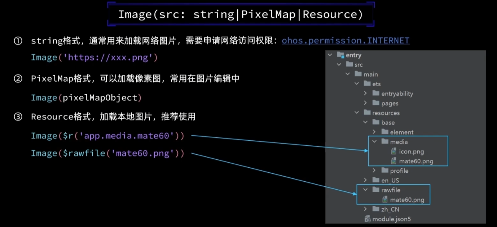
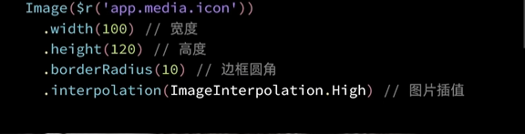
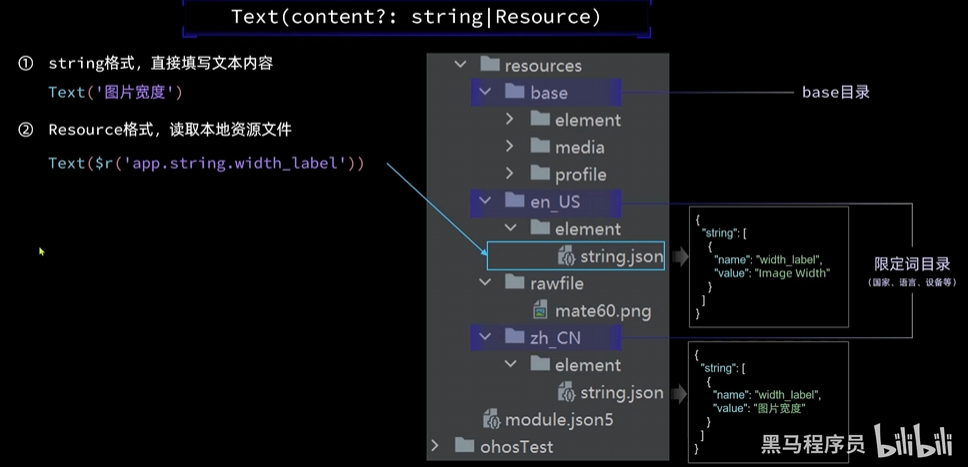
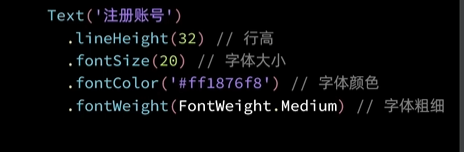
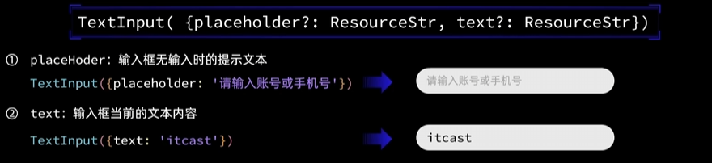
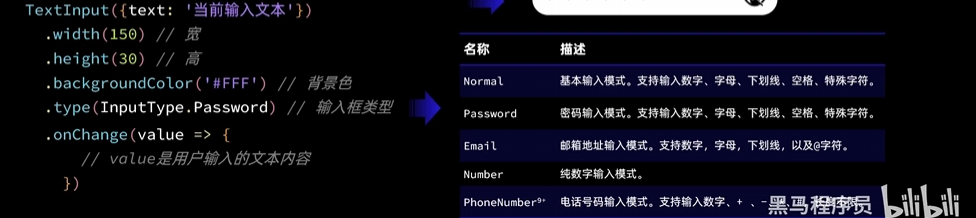

# ArkTs

- 声明式UI
- 状态管理
- ..

```
@Entry               // 标记当前组件是入口组件
@Component           // 标记自定义组件
struct Index {       // 自定义组件：可复用的UI单元
  @State message: string = 'Hello World'   // 标记该变量是状态变量，值变化时会触发UI 更新

  build() {   // UI 描述：其内部以声明式方式描述UI结构
    Row() {   // 内置组件 ArkUI
      Column() {    // 容器组件： 用来完成页面布局
        Text(this.message)   // 基础组件
          .fontSize(50)      // 属性方法：设置组件的样式
          .fontWeight(FontWeight.Bold)
          .onClick(()=>{    // 事件方法：设置组件的事件的回调
            // ...处理事件
          })
      }
    }
  }
}

```

### 基础组件

+ Image:图片显示组件

  1.声明Image组件并设置图片源

  

  2.添加图片属性

  

+ Text：文本显示组件

  1.声明Text组件并设置文本内容

  

  2.添加文本属性

  

+ TextInput：文本输入框

  1.声明TextInput组件：

  

  2.添加属性和事件：

  


### 快速格式代码  Ctrl+Alt+l

### 翻译插件 Shift+Alt+o

